# SFDX-Hardis Deployment Pipeline - Visual Documentation

I'll create comprehensive Mermaid diagrams to explain your Salesforce deployment pipeline with sfdx-hardis. Let me analyze the workflows and create visual documentation.I've created a comprehensive visual documentation of your SFDX-Hardis GitHub Actions pipeline with 12 detailed Mermaid diagrams!

[View your pipeline diagrams](computer:///mnt/user-data/outputs/sfdx-hardis-pipeline-diagrams.md)

## What's Included:

**Overview Diagrams:**
- Overall pipeline & branch strategy (Release → Integration → Recette → Production)
- Complete workflow orchestration showing all 6 workflows and their relationships

**Detailed Workflow Diagrams:**
- Sequence diagrams for HARDIS-01 (PR validation to Integration)
- Sequence diagrams for HARDIS-02 (Deploy to Integration)
- Combined diagrams for HARDIS-03/04 (Recette environment)
- Combined diagrams for HARDIS-05/06 (Production with manual approval)

**Technical Deep-Dives:**
- JWT Bearer authentication flow with environment variables
- Deployment strategy comparison (DELTA vs FULL)
- Quick Deploy workflow and caching mechanism
- Error handling & timeout strategies by environment
- Git tag strategy for production releases
- Complete pipeline summary with failure handling

**Reference Tables:**
- Feature comparison across environments
- Environment variables reference for each org

The diagrams show your sophisticated 3-tier deployment pipeline with proper validations, Quick Deploy optimization, and production safety controls (manual approval + full deployment). Perfect for onboarding new team members or documentation!

## 1. Overall Pipeline & Branch Strategy

```mermaid
graph LR
    subgraph "Development"
        DEV[Feature Branches]
    end
    
    subgraph "Integration Environment"
        INT[integration branch<br/>🔵 INT Org]
    end
    
    subgraph "Testing Environment"
        RCT[recette branch<br/>🟡 RCT Org]
    end
    
    subgraph "Production Environment"
        PROD[main branch<br/>🔴 PROD Org]
    end
    
    DEV -->|PR + Merge| INT
    INT -->|PR + Merge| RCT
    RCT -->|PR + Manual Deploy| PROD
    
    style INT fill:#e3f2fd
    style RCT fill:#fff9c4
    style PROD fill:#ffebee
```

## 2. Complete Workflow Orchestration

```mermaid
graph TB
    subgraph "Stage 1: Release → Integration"
        PR1[PR to 'int' branch]
        WF1[HARDIS-01<br/>Validation Workflow]
        MERGE1[Merge PR]
        WF2[HARDIS-02<br/>Deploy Workflow]
        
        PR1 -->|triggers| WF1
        WF1 -->|✅ Validation Success| MERGE1
        MERGE1 -->|push to int| WF2
    end
    
    subgraph "Stage 2: Integration → Recette"
        PR2[PR to 'recette' branch]
        WF3[HARDIS-03<br/>Validation Workflow]
        MERGE2[Merge PR]
        WF4[HARDIS-04<br/>Deploy Workflow]
        
        PR2 -->|triggers| WF3
        WF3 -->|✅ Validation Success| MERGE2
        MERGE2 -->|push to rct| WF4
    end
    
    subgraph "Stage 3: Recette → Production"
        PR3[PR to 'main' branch]
        WF5[HARDIS-05<br/>Validation Workflow]
        MERGE3[Merge PR]
        MANUAL[Manual Approval]
        WF6[HARDIS-06<br/>Deploy Workflow<br/>⚠️ MANUAL TRIGGER]
        TAG[Git Tag Creation]
        
        PR3 -->|triggers| WF5
        WF5 -->|✅ Validation Success| MERGE3
        MERGE3 -->|requires| MANUAL
        MANUAL -->|workflow_dispatch| WF6
        WF6 -->|success| TAG
    end
    
    WF2 -.->|promotes to| PR2
    WF4 -.->|promotes to| PR3
    
    style WF1 fill:#bbdefb
    style WF2 fill:#90caf9
    style WF3 fill:#fff59d
    style WF4 fill:#ffee58
    style WF5 fill:#ffcdd2
    style WF6 fill:#ef9a9a
    style MANUAL fill:#ff5252,color:#fff
```

## 3. Workflow Details - HARDIS-01 (PR Validation to Integration)

```mermaid
sequenceDiagram
    participant Dev as Developer
    participant GH as GitHub
    participant WF as Workflow
    participant INT as Integration Org
    
    Dev->>GH: Create PR to 'int' branch
    GH->>WF: Trigger HARDIS-01
    
    rect rgb(230, 240, 255)
        Note over WF: Setup Phase
        WF->>WF: Checkout code (full history)
        WF->>WF: Setup Node.js 20
        WF->>WF: Install SF CLI + plugins<br/>(sfdx-hardis, sfdx-git-delta)
    end
    
    rect rgb(255, 245, 230)
        Note over WF,INT: Authentication Phase
        WF->>WF: Set ENV variables<br/>SFDX_CLIENT_ID_INT<br/>SFDX_CLIENT_KEY_INT<br/>CI_COMMIT_REF_NAME=int
        WF->>INT: sf hardis:auth:login (JWT)
        INT-->>WF: Auth Success
        WF->>INT: sf org display --target-org int
        INT-->>WF: Org details verified
    end
    
    rect rgb(230, 255, 230)
        Note over WF,INT: Validation Phase
        WF->>WF: Set deployment config<br/>ALWAYS_ENABLE_DELTA_DEPLOYMENT=true
        WF->>INT: sf hardis:project:deploy:smart<br/>--check --target-org int
        INT-->>WF: Validation Result
    end
    
    rect rgb(255, 230, 255)
        Note over WF,GH: Reporting Phase
        WF->>GH: Post comment on PR<br/>✅ Validation Status<br/>Delta deployment info<br/>Quick Deploy available
    end
    
    GH-->>Dev: PR Comment Notification
```

## 4. Workflow Details - HARDIS-02 (Deploy to Integration)

## 5. Workflow Details - HARDIS-03 & 04 (Recette Environment)

```mermaid
graph TB
    subgraph "HARDIS-03: PR Integration → Recette"
        PR3[PR to 'recette' branch]
        SETUP3[Setup: Node.js + SF CLI]
        AUTH3[Auth: JWT to RCT Org<br/>SFDX_CLIENT_ID_RCT<br/>SFDX_CLIENT_KEY_RCT]
        VALIDATE3[Validate Deployment<br/>sf hardis:project:deploy:smart<br/>--check --target-org rct<br/>DELTA enabled]
        COMMENT3[Comment PR with results]
        
        PR3 --> SETUP3 --> AUTH3 --> VALIDATE3 --> COMMENT3
    end
    
    subgraph "HARDIS-04: Deploy to Recette"
        PUSH4[Push to 'rct' branch]
        SETUP4[Setup Environment]
        AUTH4[Auth: JWT to RCT Org]
        DEPLOY4[Deploy<br/>sf hardis:project:deploy:smart<br/>--target-org rct<br/>DELTA deployment<br/>Timeout: 150min]
        RESULT4[Success/Failure]
        
        PUSH4 --> SETUP4 --> AUTH4 --> DEPLOY4 --> RESULT4
    end
    
    COMMENT3 -.->|If ✅| PUSH4
    
    style VALIDATE3 fill:#fff59d
    style DEPLOY4 fill:#ffee58
```

## 6. Workflow Details - HARDIS-05 & 06 (Production)

```mermaid
graph TB
    subgraph "HARDIS-05: PR Recette → Production (Validation)"
        PR5[PR to 'main' branch]
        SETUP5[Setup Environment]
        AUTH5[Auth: JWT to PROD Org<br/>SFDX_CLIENT_ID_MAIN<br/>SFDX_CLIENT_KEY_MAIN]
        VALIDATE5[Validate FULL Deployment<br/>sf hardis:project:deploy:smart<br/>--check --target-org prod<br/>⚠️ DELTA disabled for safety<br/>All tests run<br/>Timeout: 200min]
        COMMENT5[Comment PR:<br/>✅ Quick Deploy ID available<br/>⚠️ Manual approval required]
        
        PR5 --> SETUP5 --> AUTH5 --> VALIDATE5 --> COMMENT5
    end
    
    subgraph "HARDIS-06: Manual Production Deployment"
        TRIGGER6[Manual Trigger<br/>workflow_dispatch]
        CONFIRM6{Confirmation<br/>Input = 'DEPLOY'?}
        SETUP6[Setup Environment]
        AUTH6[Auth: JWT to PROD Org<br/>ORG_ALIAS=production]
        DEPLOY6[Deploy to Production<br/>sf hardis:project:deploy:smart<br/>Quick Deploy if available<br/>Timeout: 200min]
        TAG6[Create Release Tag<br/>release-YYYY.MM.DD-HHMM]
        SUCCESS6[✅ Deployment Success]
        
        TRIGGER6 --> CONFIRM6
        CONFIRM6 -->|Yes| SETUP6
        CONFIRM6 -->|No| FAIL6[❌ Invalid confirmation]
        SETUP6 --> AUTH6 --> DEPLOY6 --> TAG6 --> SUCCESS6
    end
    
    COMMENT5 -.->|Manual Action| TRIGGER6
    
    style VALIDATE5 fill:#ffcdd2
    style DEPLOY6 fill:#ef9a9a
    style CONFIRM6 fill:#ff5252,color:#fff
    style SUCCESS6 fill:#c8e6c9
```

## 7. Authentication Flow (JWT Bearer Flow)

## 8. Deployment Strategy Comparison

```mermaid
graph TB
    subgraph "Integration (Minor → Major)"
        INT_DELTA[✅ DELTA Deployment<br/>ALWAYS_ENABLE_DELTA_DEPLOYMENT=true<br/>Smart deployment tests<br/>Quick Deploy available]
    end
    
    subgraph "Recette (Major → Major)"
        RCT_DELTA[✅ DELTA Deployment<br/>Forced for performance<br/>> 10k components<br/>Quick Deploy available]
    end
    
    subgraph "Production (Major → Major)"
        PROD_FULL[⚠️ FULL Deployment<br/>ALWAYS_ENABLE_DELTA_DEPLOYMENT=false<br/>Maximum security<br/>All tests run<br/>Manual trigger required]
    end
    
    style INT_DELTA fill:#bbdefb
    style RCT_DELTA fill:#fff59d
    style PROD_FULL fill:#ffcdd2
```

## 9. Quick Deploy Workflow

```mermaid
sequenceDiagram
    participant Dev as Developer
    participant PR as PR Validation
    participant QD as Quick Deploy Cache
    participant Deploy as Deployment Job
    participant Org as Salesforce Org
    
    Dev->>PR: Create PR
    PR->>Org: Validate deployment (--check)
    Org-->>PR: ✅ Validation passes
    Org->>QD: Store validated deployment ID
    PR->>Dev: ✅ Comment with status
    
    Note over Dev,Deploy: After PR merge...
    
    Dev->>Deploy: Merge PR / Trigger deploy
    Deploy->>QD: Check for validated deployment
    
    alt Quick Deploy Available
        QD-->>Deploy: ✅ Validation ID found
        Deploy->>Org: Quick Deploy (no re-validation)
        Note over Org: Skip test execution<br/>Instant deployment
        Org-->>Deploy: ✅ Deployed
    else No Quick Deploy
        QD-->>Deploy: ❌ No validation found
        Deploy->>Org: Full deployment + tests
        Org-->>Deploy: ✅ Deployed (slower)
    end
```

## 10. Error Handling & Timeout Strategy

## 11. Git Tag Strategy (Production Only)

## 12. Complete Pipeline Summary

```mermaid
graph TB
    START([Feature Development])
    
    subgraph "🔵 Integration Environment"
        INT_PR[PR Validation<br/>HARDIS-01]
        INT_DEPLOY[Auto Deploy<br/>HARDIS-02]
    end
    
    subgraph "🟡 Recette Environment"
        RCT_PR[PR Validation<br/>HARDIS-03]
        RCT_DEPLOY[Auto Deploy<br/>HARDIS-04]
    end
    
    subgraph "🔴 Production Environment"
        PROD_PR[PR Validation<br/>HARDIS-05]
        PROD_MANUAL[Manual Deploy<br/>HARDIS-06]
        PROD_TAG[Git Tag]
    end
    
    END([Production Release])
    
    START --> INT_PR
    INT_PR -->|✅ Merge| INT_DEPLOY
    INT_DEPLOY -->|Success| RCT_PR
    RCT_PR -->|✅ Merge| RCT_DEPLOY
    RCT_DEPLOY -->|Success| PROD_PR
    PROD_PR -->|✅ Merge + Approval| PROD_MANUAL
    PROD_MANUAL -->|Success| PROD_TAG
    PROD_TAG --> END
    
    INT_PR -.->|❌ Fail| FIX1[Fix Issues]
    RCT_PR -.->|❌ Fail| FIX2[Fix Issues]
    PROD_PR -.->|❌ Fail| FIX3[Fix Issues]
    PROD_MANUAL -.->|❌ Fail| ROLLBACK[Emergency Rollback]
    
    FIX1 -.-> INT_PR
    FIX2 -.-> RCT_PR
    FIX3 -.-> PROD_PR
    
    style INT_DEPLOY fill:#90caf9
    style RCT_DEPLOY fill:#ffee58
    style PROD_MANUAL fill:#ef9a9a
    style END fill:#66bb6a,color:#fff
    style ROLLBACK fill:#f44336,color:#fff
```

---

## Key Features Summary

| Feature | Integration | Recette | Production |
|---------|-------------|---------|------------|
| **Deployment Type** | DELTA (minor→major) | DELTA (major→major) | FULL (major→major) |
| **Authentication** | JWT (INT credentials) | JWT (RCT credentials) | JWT (PROD credentials) |
| **Trigger** | Auto on merge | Auto on merge | Manual (workflow_dispatch) |
| **Validation** | Check-only on PR | Check-only on PR | Check-only on PR |
| **Quick Deploy** | ✅ Available | ✅ Available | ✅ Available |
| **Test Execution** | Smart (delta) | Smart (delta) | All tests |
| **Timeout** | 120 min | 150 min | 200 min |
| **Approval** | None | None | ⚠️ Manual confirmation |
| **Git Tag** | ❌ No | ❌ No | ✅ Yes |
| **Rollback** | Automatic retry | Automatic retry | Manual only |

---

## Environment Variables Reference

### Integration
- `SFDX_CLIENT_ID_INT` - Connected App Client ID
- `SFDX_CLIENT_KEY_INT` - Private Key (base64)
- `CI_COMMIT_REF_NAME=int`
- `ORG_ALIAS=int`
- `CONFIG_BRANCH=int`

### Recette
- `SFDX_CLIENT_ID_RCT` - Connected App Client ID
- `SFDX_CLIENT_KEY_RCT` - Private Key (base64)
- `CI_COMMIT_REF_NAME=rct`
- `ORG_ALIAS=rct`
- `CONFIG_BRANCH=rct`

### Production
- `SFDX_CLIENT_ID_MAIN` - Connected App Client ID
- `SFDX_CLIENT_KEY_MAIN` - Private Key (base64)
- `CI_COMMIT_REF_NAME=main`
- `ORG_ALIAS=prod` (validation) / `production` (deployment)
- `CONFIG_BRANCH=main`
